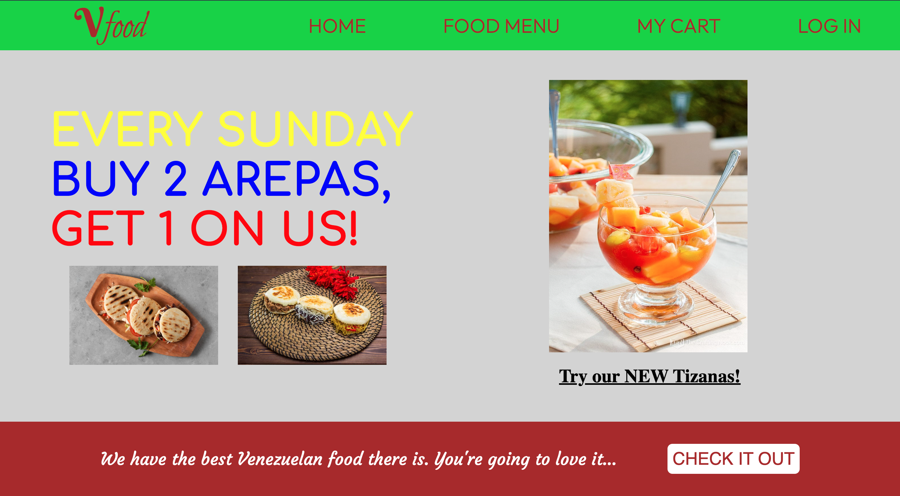
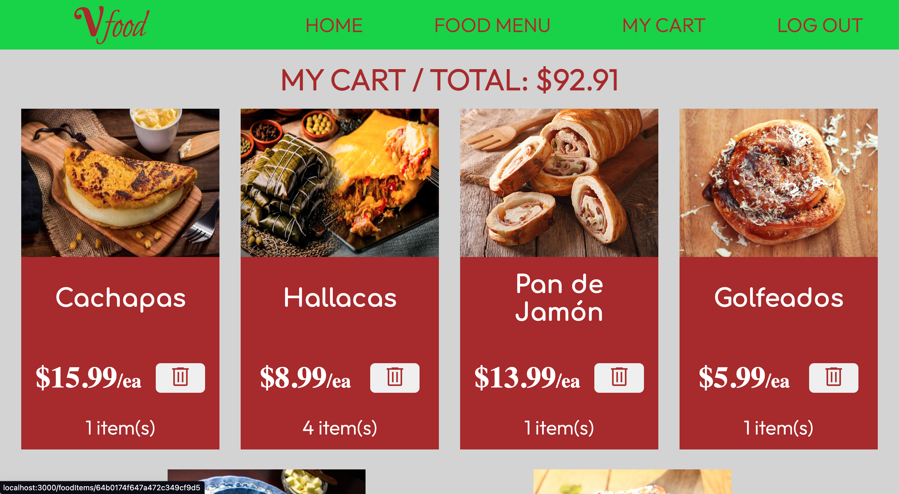
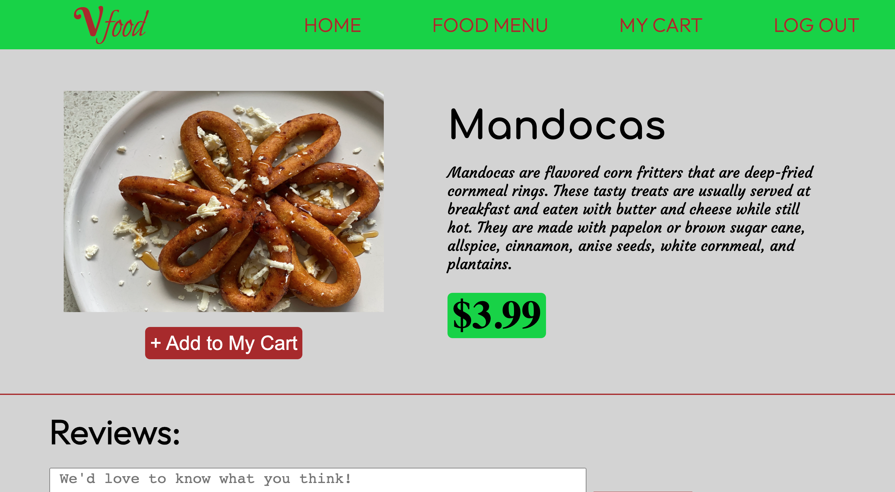
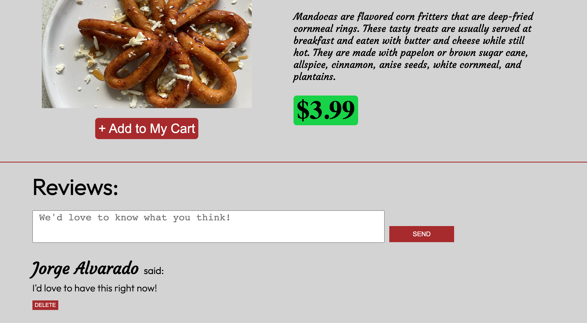

# "Vfood" Restaurant Web Application

### Link to the website: https://wild-erin-brown-bear-coat.cyclic.app

This project is a simulation to a web application for a Venezuelan restaurant. I wanted to share a little bit about my culture and where I am from through something we all love: food!

This interactive website will let you discover and learn about the food and different dishes from Venezuela, leave a comment or thought that you may have about every single one of them, and also add the ones you'd like to get into a virtual cart.

## Technologies Used:

-JavaScript  
-Node JS  
-Express  
-Mongoose  
-MongoDB  
-EJS  
-CSS

## My experience building this project

This project was sort of challenging but it felt really good accomplishing each thing, step by step. I've realized that there's so much I can improve and fix in this project, so the experience is not over yet.

## Some of the biggest challenges were:

-Building certain relationships between some models.  
-Routing and creating the cart so every user could get their own.  
-Making it so the items added to a cart wouldn't show repeatedly if the user decided to add more than one of the same item but just show them once with their respective quantity amount.

## Screenshots of the website:

